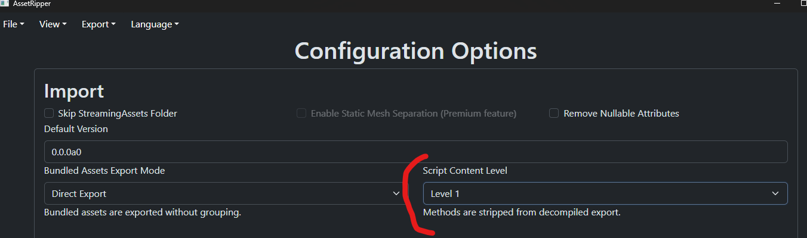
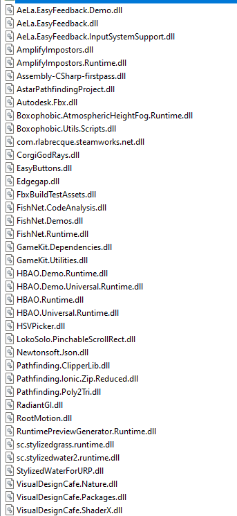

Open AssetRipper https://github.com/AssetRipper/AssetRipper. Make sure you have the latest version.

Open AssetRipper and in the Settings make sure Script Content Level is set to 1.


Export Game.

Now go to the Exported Project folder and open Scripts. 
Follow these steps to fix the scripts:

Add this line on top of the following files:
```csharp
using Grid = ScheduleOne.Tiles.Grid;
```

BuildManager.cs
BuildUpdate_Grid.cs
Autotest.cs
Constructable_GridBased.cs
ConstructionManager.cs
GridItem.cs
BrickPressData.cs
DryingRackData.cs
ChemistryStationData.cs
CauldronData.cs
LabOvenData.cs
GridItemData.cs
MixingStationData.cs
PotData.cs
PackagingStationData.cs
PlaceableStorageData.cs
DryingRack.cs
SoilPourerData.cs
ToggleableItemData.cs
BrickPress.cs
TrashContainerData.cs
LaunderingStation.cs
Cauldron.cs
LabOven.cs
PackagingStation.cs
ChemistryStation.cs
MixingStation.cs
Pot.cs
TrashContainerItem.cs

Create Beautify.cs in Scripts\Beautify\Universal containing:
```csharp
namespace Beautify.Universal
{
    public class Beautify
    {
    }
}
```

Grab Unity.RenderPipelines.Universal.Runtime.dll from the Game's managed Folder.
Use Refasmer https://github.com/JetBrains/Refasmer to strip the method contents from the dll.
Use the following settings:
```bash
refasmer -r --all Unity.RenderPipelines.Universal.Runtime.dll
```

Decompile the output dll with jetbrains dotPeek (other decompilers should work as well).

Open VolumetricFogAndMist2 from the decompiled Assembly and copy it to the respective folder in your Scripts folder. 

Now convert the namespaces in these decompiled Files to block scoped namespaces.

2 more edits:
NumberVariable.cs, line 8: Change last argument to (float)default

BoolVariable.cs, line 8: Change last argument to (byte)(int)default != 0

Now go back into the Assets folder and open the plugins folder. Delete everything. Copy the following dll's from the game's managed folder into the plugins folder:


It should compile now. 
\
\
\
\
Support me on Ko-fi or Patreon if you like my work :)

[](https://ko-fi.com/U7U1XZHXW)
[](https://patreon.com/FranzFischer?utm_medium=unknown&utm_source=join_link&utm_campaign=creatorshare_creator&utm_content=copyLink)